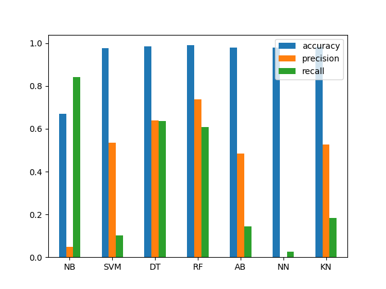

# Content-Based Phishing Detection

## Description

Content-based phishing detection relies on analyzing the HTML content of emails or websites to identify potential phishing attempts. Through this approach, machine learning algorithms can detect patterns and features indicative of phishing, such as deceptive language, suspicious URLs, or impersonation of legitimate entities. By examining the HTML structure and content, this technique helps to automatically flag or block suspicious messages or websites, thereby reducing the risk of phishing attacks
## Screenshots

### *Analyzing Accuracy, Precision, and Recall for different Algorithms on a given dataset, visualizations depicting the comparison of accuracy, precision, and recall across different algorithms.*

### *Streamlit app output showing the classification result indicating whether the site is legitimate or phishing.*

  <b>Made with ❤️ by Ajay Shitkar 
</b>

